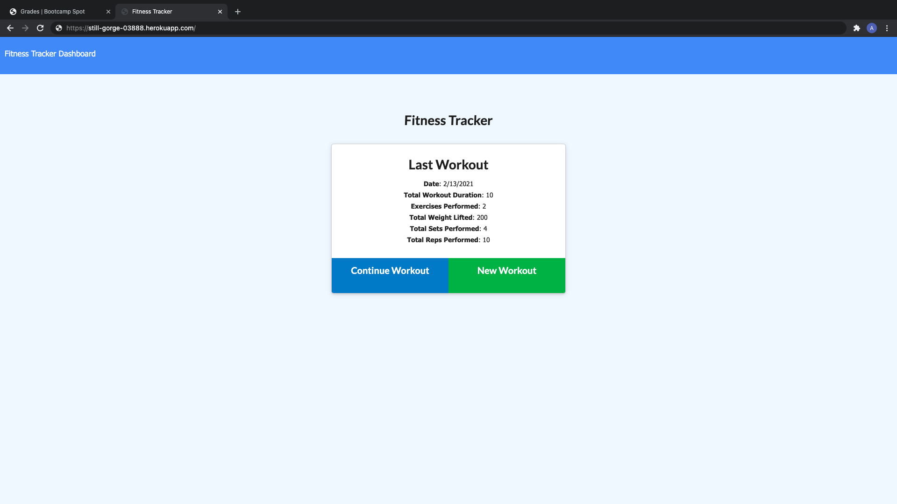

# Workout-Tracker-Application

UW Homework 17

[](https://opensource.org/licenses/MIT)

## Description

Hello everyone, and welcome back to my Repo! My name is Abdulhakeem Dahir and I am an aspiring Software Developer. This week I have been tasked to make a Fitness Tracker Application. This application will help you keep track of your daily workouts. Hope you like, any feedback is welcome.

## Table of Contents

- [Description](#description)
- [Installation](#installation)
- [Usage](#usage)
- [License](#license)
- [Live](#live)
- [Questions](#questions)

## Installation

Please follow the installation process below:

```
1. Fork the repository from the link below
2. Clone the repo to your computer via git
3. Open the project files with the text editor of your choice.
4. Install npm dependencies
```

Respository:
https://github.com/abdulhakeemdahir/Workout-Tracker-Application

## Usage

To use the application, you have to install the Inquirer NPM package and Express. Then you run the application by running node index.js in your integrated terminal.

## License

This application is covered under the MIT License

## Live

Below is the link to the live site:
https://still-gorge-03888.herokuapp.com/



## Questions

If you would like to contribute, please contact me and I will add you as a contributor. My contact information is below.

Github Profile: www.github.com/abdulhakeemdahir

E-mail: somlutions@gmail.com
